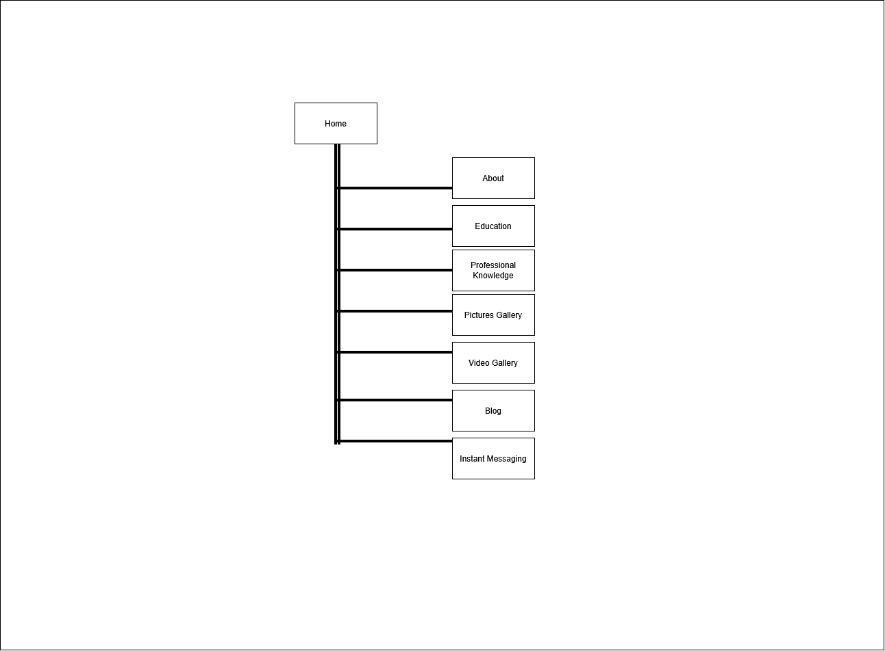
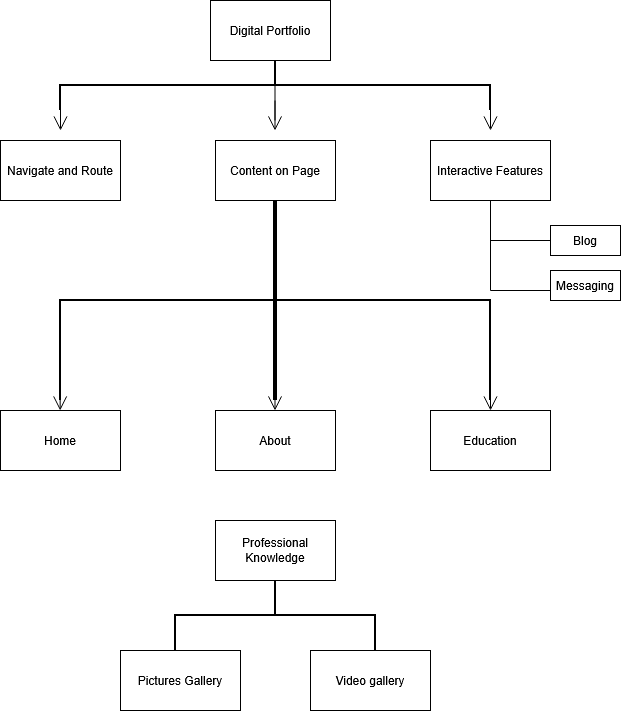
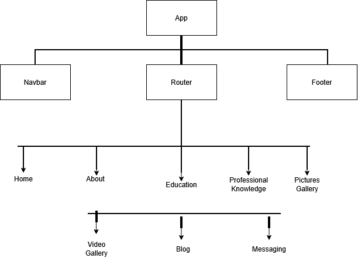

# CS5709-Digital-Portfolio

## Phase 1

## Introduction

*** This README.md document provides information about the CS5709 digital portfolio I created as part of the module project-based assessment. ***

## Discovery

EXAMPLE PORTFOLIO @ https://saaysalim.github.io/Salim-Saay/

The example portfolio at https://saaysalim.github.io/Salim-Saay/ was used to identify strengths and weaknesses. These are detailed in the table below:

| Area | Strength | Weakness | What I would do differently |
| --- | --- | --- | --- |
| Navigation | Other headings are immediately accessible from the landing page via the header | It is all located on one page – no URL routing | Use React router |
| Homepage | Clear introduction to portfolio owner | Important information is not immediately visible | A concise blurb at the top to introduce myself |
| About | Includes important background information | Information is not easily accessible | Use of sections with clearly defined headings |
| Education | Education has its own section | Better visual presentation needed | Use chronological order and images to make it more intuitive |
| Gallery | Dedicated section for gallery images | Images could provide links to external sites that are relevant to the image | Use of meaningful and useful captions |
| Video | Video content is separated effectively from other media types | Videos require greater descriptions | Use of captions for videos |
| Blog | Adds interactive content that extends beyond the portfolio itself | The functionality of the blog brings more backend complexity to the digital portfolio | Keep blog functionality simple |
| Visual Layout | Consistent presentation, colours, patterns, etc. | Can appear sparse in areas and too dense in others | Consistency in visual layout and ensuring space is used evenly and appropriately |

## Features Identified

The below table shows the most important features that will be included in this digital portfolio:

| Feature | Phase | Reason |
| --- | --- | --- |
| Home | Phase 1 | This will be the landing page for the digital portfolio. |
| About | Phase 1 | This will provide information about the portfolio owner |
| Education | Phase 1 | This will provide information about their educational background |
| Professional Knowledge | Phase 1 | This will provide information about their professional and technical knowledge |
| Pictures Gallery | Phase 1 | This will provide pictures in a  photo-gallery format |
| Video Gallery | Phase 1 | This will provide videos in a video-gallery format |
| Blog | Phase 1 | This provides information about the creator’s blog |
| Instant Messaging | Phase 1 | This enables a user to contact the owner of the digital portfolio |

## Functional Requirements

The below table details the functional requirements for each feature:

| Feature | Functional Requirements |
| --- | --- |
| Home | This page will be used as a main landing point for the application |
| About | This page will provide information about the creator of the digital portfolio |
| Education | This page will provide information about the creator’s educational background |
| Professional Knowledge | This page will provide information about the creator’s professional knowledge |
| Pictures Gallery | This page will provide a collection of images in containers |
| Video Gallery | This page will provide video content in containers |
| Blog | This page will include a short blog |
| Instant Messaging | This page will provide an instant messaging feature to contact the creator |

## Non-Functional Requirements

The below table outlines the non-functional requirements of the digital portfolio:

| Aspect | Non-Functional Requirement |
| --- | --- |
| Visual | The digital portfolio will have a consistent visual style on all pages |
| Navigation | The means of navigating across the portfolio will be consistent on all pages |
| Responsive design | The digital portfolio will have a suitable layout for all screen sizes |
| Code | The React code will be reusable |
| Text/Elements | The text and elements will be readable against background colours |

## Portfolio Scheme

The below diagram showcases the portfolio scheme for the digital portfolio:

## Design

This section showcases the block, component, and control flow diagrams that were used in the development of the digital portfolio.

## Block Diagram:

This showcases the main functional areas for Phase 1

## Component Diagram:

This component diagram showcases a proposed design

